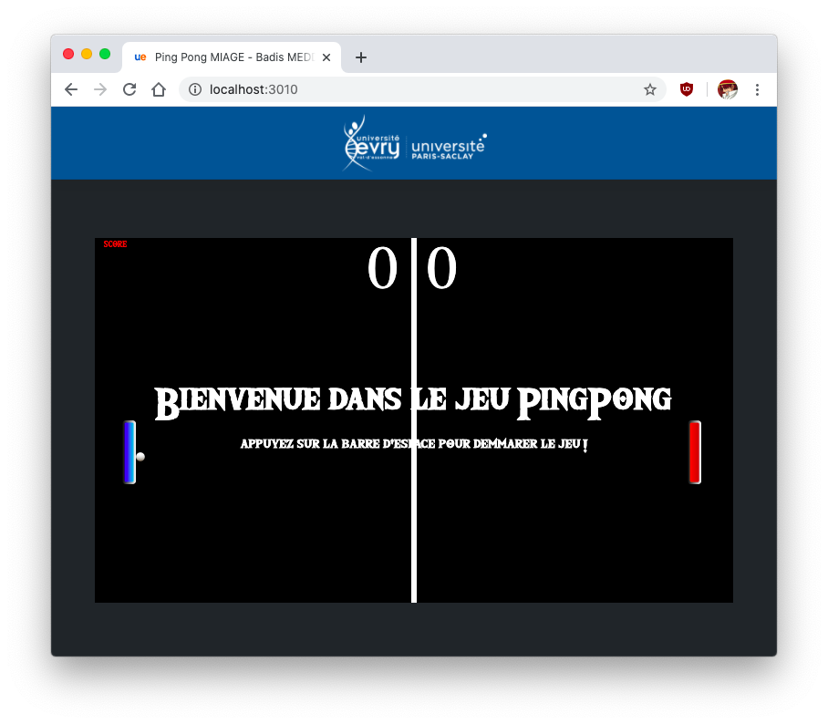

# PingPongJS MIAGE

Jeu Ping Pong avec le mode singleplayer et multiplayer propulsé par JavaScript.

## Professeur
* Didier Courtaud

## Auteur

* MEDDOURI Badis

## Comment jouer ?

1. Assurez vous d'avoir lancez la commande ``npm install`` pour installer les dépendances nécessaires.
2. Lancez le serveur à l'aide de la commande `node server.js` !
3. Sur votre navigateur internet, rendez vous sur l'URL suivante : http://localhost:3010/

### Mode 1 joueur :
1. Pour lancer le mode un joueur, il vous suffit d'appuyer sur le boutton Start
2. Appuyez sur la barre d'espace pour lancer le jeu
3. Jouer !

### Mode 2 joueurs :
1. Lancez 2 navigateurs à l'adresse suivante : http://localhost:3010/, le jeu détectera automatiquement que vous entrez en mode 2 joueurs.
2. Appuyez sur la barre d'espace sur les deux pages pour signaler que vous êtes prêts.
3. Jouer !

### Mode 4 joueurs :
1. Lancez 1 navigateurs à l'adresse suivante : http://localhost:3010/, appuyez sur le boutton : Mode 4 Joeurs
2. Lancez 3 autres navigateurs sur l'adresse http://localhost:3010/
3. Appuyez sur la barre d'espce pour chacunes des pages !
3. Jouer !

## Technologies utilisées

J'utilise `socket.io`, `expressJS` côté back et `HTML5` + `canvas` pour le Front. 
Possibilitée de lancer avec `docker`.

  

